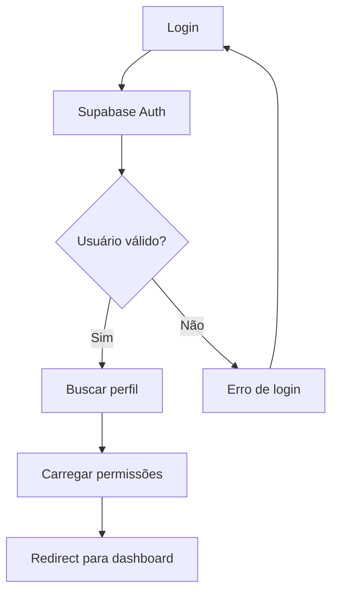
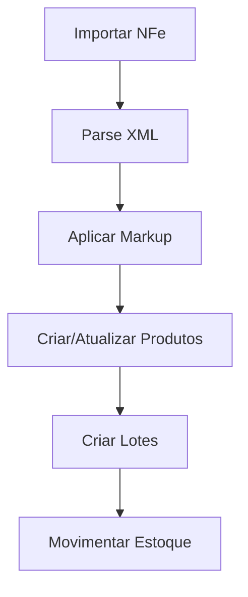
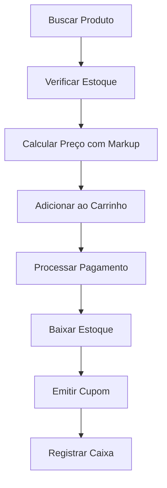

# Especificações Técnicas - Pharma.AI
**Atualizado:** 2024-12-26  
**Versão:** 3.1.0  
**Tipo:** Documentação Técnica

---

## 🏗️ **ARQUITETURA DO SISTEMA**

### **Stack Tecnológico**
```
📱 Frontend
├── React 18.2.0 + TypeScript 5.0+
├── Vite 5.0+ (Build Tool)
├── Tailwind CSS 3.3+ 
├── shadcn/ui (Componentes)
├── React Query 4.0+ (Estado Servidor)
├── React Router v6 (Navegação)
└── React Hook Form (Formulários)

🗄️ Backend
├── Supabase (BaaS)
│   ├── PostgreSQL 15+ (Banco)
│   ├── Auth (Autenticação)
│   ├── Realtime (WebSockets)
│   ├── Storage (Arquivos)
│   └── Edge Functions (Serverless)
└── MCP (Model Context Protocol)

🔧 DevOps
├── Git + GitHub (Controle versão)
├── Vercel (Deploy frontend)
├── Supabase Cloud (Infraestrutura)
└── GitHub Actions (CI/CD planejado)
```

---

## 🗄️ **ESTRUTURA DO BANCO DE DADOS**

### **Tabelas Principais (35+ tabelas)**

#### **👥 Usuários e Permissões (4 tabelas)**
```sql
-- Autenticação base
usuarios (id, email, nome, perfil_id, ativo, created_at, updated_at)
perfis_usuario (id, nome, descricao, nivel_acesso)
permissoes (id, modulo, acao, nivel, descricao)
sessoes_usuario (id, usuario_id, token, expires_at)
```

#### **📦 Estoque e Produtos (8 tabelas)**
```sql
-- Gestão de produtos e estoque
produtos (id, nome, codigo_interno, categoria_id, tipo, unidade_medida)
categoria_produto (id, nome, descricao, markup_padrao)
insumos (id, produto_id, concentracao, origem)
embalagens (id, produto_id, capacidade, material)
lote (id, numero_lote, produto_id, fornecedor_id, data_validade, quantidade_inicial, quantidade_atual)
lotes_insumos (id, lote_id, insumo_id, quantidade_utilizada)
movimentacoes_estoque (id, produto_id, tipo, quantidade, data_movimentacao)
forma_farmaceutica (id, nome, descricao)
```

#### **🛒 Sistema de Vendas (6+ tabelas)**
```sql
-- Core do sistema de vendas
vendas (
  id, 
  numero_venda, 
  usuario_id, -- Controle por atendente
  cliente_id, 
  total, 
  desconto, 
  status, -- rascunho, aberta, finalizada, cancelada
  status_pagamento, -- pendente, parcial, pago
  data_venda, 
  observacoes,
  created_at, 
  updated_at
)

-- Itens de cada venda
vendas_itens (
  id, 
  venda_id, 
  produto_id, 
  quantidade, 
  preco_unitario, 
  preco_total, 
  desconto_item,
  observacoes
)

-- Pagamentos realizados
vendas_pagamentos (
  id, 
  venda_id, 
  forma_pagamento, -- dinheiro, cartao_debito, cartao_credito, pix, transferencia
  valor, 
  bandeira_cartao, 
  numero_autorizacao, 
  codigo_transacao,
  observacoes,
  data_pagamento
)

-- Controle de caixa
caixa (
  id, 
  usuario_id, 
  data_abertura, 
  data_fechamento, 
  valor_inicial, 
  valor_final, 
  total_vendas, 
  total_sangrias,
  diferenca, 
  status, -- aberto, fechado
  observacoes
)

-- Sangrias e reforços de caixa
caixa_movimentacoes (
  id, 
  caixa_id, 
  tipo, -- sangria, reforco
  valor, 
  motivo, 
  autorizado_por, 
  data_movimentacao
)

-- Histórico para auditoria
vendas_historico (
  id, 
  venda_id, 
  acao, -- criada, alterada, finalizada, cancelada
  usuario_id, 
  dados_alteracao,
  data_acao
)
```

#### **🏪 Fornecedores e Cadastros (4 tabelas)**
```sql
-- Cadastros essenciais
fornecedores (id, nome, documento, telefone, email, endereco)
clientes (id, nome, cpf, telefone, email, endereco) -- Planejado
medicos (id, nome, crm, especialidade, telefone) -- Planejado
contatos_fornecedor (id, fornecedor_id, nome, cargo, telefone, email) -- Planejado
```

#### **🏷️ Sistema de Markup (3 tabelas)**
```sql
-- Cálculo de preços
configuracao_markup (id, categoria, markup_percentual, margem_minima, margem_maxima)
categoria_markup (id, nome, markup_padrao, ativo)
historico_precos (id, produto_id, preco_custo, preco_venda, markup_aplicado, data_alteracao)
```

#### **💰 Financeiro (3 tabelas)**
```sql
-- Gestão financeira
movimentacoes_caixa (id, tipo, valor, descricao, categoria_id, data_movimentacao)
categorias_financeiras (id, nome, tipo, descricao)
contas_a_pagar (id, fornecedor_id, valor, data_vencimento, status, descricao)
```

#### **🏭 Produção (4 tabelas)**
```sql
-- Sistema de produção
ordens_producao (id, receita_id, quantidade, status, data_inicio, data_conclusao)
receitas (id, nome, formulacao, instrucoes, tempo_preparo)
medicamentos (id, receita_id, tipo, concentracao, forma_farmaceutica_id)
qualidade_controle (id, ordem_producao_id, teste_realizado, resultado, aprovado)
```

#### **🤖 IA e Processamento (3 tabelas)**
```sql
-- Funcionalidades de IA
receitas_raw (id, texto_original, data_upload, processado)
receitas_processadas (id, receita_raw_id, dados_extraidos, medicamentos_identificados)
chatbot_memory (id, sessao_id, pergunta, resposta, contexto, timestamp)
```

---

## 🛒 **SISTEMA DE VENDAS - ESPECIFICAÇÕES**

### **Arquitetura de Componentes**
```
📁 src/pages/admin/vendas/
├── index.tsx                   # Overview do sistema de vendas
├── pdv.tsx                     # PDV - Ponto de Venda (Frontend)
├── fechamento.tsx              # Finalização de vendas pendentes
├── historico.tsx               # Histórico de vendas
├── caixa.tsx                   # Controle de caixa
└── relatorios.tsx              # Relatórios (planejado)

📁 Components específicos:
├── VendaCard                   # Card de venda individual
├── CarrinhoCompras             # Gerenciamento do carrinho
├── BuscaProdutos              # Busca inteligente de produtos
├── FormaPagamento             # Seleção de forma de pagamento
├── CalculadoraTroco           # Cálculo automático de troco
└── PrintReceipt               # Impressão de cupom (planejado)
```

### **RLS (Row Level Security) para Vendas**
```sql
-- Atendentes só veem suas próprias vendas
CREATE POLICY "Atendentes veem próprias vendas" ON vendas
FOR SELECT USING (
  usuario_id = auth.uid() OR
  EXISTS (
    SELECT 1 FROM usuarios u 
    WHERE u.id = auth.uid() 
    AND u.perfil_id IN ('proprietario', 'farmaceutico')
  )
);

-- Administradores veem todas as vendas
CREATE POLICY "Admin vê todas vendas" ON vendas
FOR ALL USING (
  EXISTS (
    SELECT 1 FROM usuarios u 
    WHERE u.id = auth.uid() 
    AND u.perfil_id IN ('proprietario', 'farmaceutico')
  )
);
```

### **Fluxo de Venda Completo**
```typescript
interface VendaFluxo {
  // 1. Criação da venda
  criarVenda: () => {
    status: 'rascunho',
    usuario_id: currentUser.id,
    data_venda: new Date(),
    total: 0
  };

  // 2. Adição de produtos
  adicionarProduto: (produto: Produto, quantidade: number) => {
    // Verificar estoque
    // Aplicar markup
    // Adicionar ao carrinho
    // Recalcular total
  };

  // 3. Processamento de pagamento
  processarPagamento: (pagamentos: PagamentoVenda[]) => {
    // Validar valor total
    // Registrar pagamentos
    // Calcular troco
    // Finalizar venda
  };

  // 4. Finalização
  finalizarVenda: () => {
    // Baixar estoque
    // Registrar movimentação
    // Emitir cupom
    // Atualizar caixa
  };
}
```

### **Interface PDV Moderna**
```typescript
// Estrutura do PDV implementado
interface PDVInterface {
  searchBar: {
    placeholder: "Buscar produtos por nome, código ou categoria...",
    autoComplete: true,
    suggestProducts: true
  };
  
  productGrid: {
    layout: "grid" | "list",
    quickAdd: true,
    stockIndicator: true,
    priceWithMarkup: true
  };
  
  cart: {
    sidePanel: true,
    editQuantity: true,
    removeItems: true,
    applyDiscount: true,
    calculateTotal: true
  };
  
  payment: {
    multiplePayments: true,
    forms: ["dinheiro", "cartao_debito", "cartao_credito", "pix"],
    calculateChange: true,
    printReceipt: true
  };
}
```

---

## 🔐 **SEGURANÇA E PERMISSÕES**

### **Row Level Security (RLS)**
```sql
-- Exemplo de política RLS
CREATE POLICY "Users can view own data" ON usuarios
FOR SELECT USING (auth.uid() = id);

CREATE POLICY "Admin can manage all" ON usuarios
FOR ALL USING (
  EXISTS (
    SELECT 1 FROM usuarios u 
    WHERE u.id = auth.uid() 
    AND u.perfil_id = 'admin'
  )
);
```

### **Sistema de Permissões**
```typescript
interface Permissao {
  modulo: ModuloSistema;
  acao: AcaoPermissao; // CRIAR, LER, ATUALIZAR, DELETAR, GERENCIAR
  nivel: NivelAcesso;  // PROPRIETARIO, FARMACEUTICO, ATENDENTE, MANIPULADOR
}

enum ModuloSistema {
  USUARIOS_PERMISSOES = 'usuarios_permissoes',
  ESTOQUE = 'estoque',
  PRODUCAO = 'producao',
  FINANCEIRO = 'financeiro',
  CADASTROS = 'cadastros',
  ATENDIMENTO = 'atendimento',
  VENDAS = 'vendas', // NOVO
  IA = 'ia',
  CONFIGURACOES = 'configuracoes',
  RELATORIOS = 'relatorios'
}
```

---

## 🎨 **ESTRUTURA DO FRONTEND**

### **Organização de Pastas**
```
📁 src/
├── 🎯 App.tsx                    # App principal
├── 📁 components/               # Componentes reutilizáveis
│   ├── ui/                     # shadcn/ui base
│   ├── Auth/                   # Autenticação
│   ├── estoque/                # Estoque específicos
│   ├── vendas/                 # Componentes de vendas
│   ├── markup/                 # Sistema de markup
│   └── layouts/                # Layouts base
├── 📁 pages/                   # Páginas da aplicação
│   ├── admin/                  # Área administrativa
│   │   ├── estoque/           # Gestão de estoque
│   │   ├── producao/          # Sistema de produção
│   │   ├── vendas/            # Sistema de vendas
│   │   ├── cadastros/         # Cadastros básicos
│   │   ├── financeiro/        # Gestão financeira
│   │   ├── configuracoes/     # Configurações
│   │   └── ia/                # Funcionalidades IA
│   └── public/                # Páginas públicas
├── 📁 modules/                 # Módulos específicos
│   └── usuarios-permissoes/   # Sistema completo de usuários
├── 📁 services/               # Lógica de negócio
│   ├── vendaService.ts        # Lógica de vendas
│   ├── markupService.ts       # Cálculo de markup
│   ├── authService.ts         # Autenticação
│   └── supabaseClient.ts      # Cliente Supabase
├── 📁 types/                  # Definições TypeScript
├── 📁 hooks/                  # Custom hooks
└── 📁 utils/                  # Funções utilitárias
```

### **Padrões de Componentes**
```typescript
// Padrão de componente com TypeScript
interface ComponentProps {
  prop1: string;
  prop2?: number;
  onAction: (data: DataType) => void;
}

export const Component: React.FC<ComponentProps> = ({ 
  prop1, 
  prop2 = 0, 
  onAction 
}) => {
  const [state, setState] = useState<StateType>(initialState);
  
  const { data, isLoading, error } = useQuery({
    queryKey: ['key'],
    queryFn: fetchFunction
  });
  
  return (
    <div className="container mx-auto p-4">
      {/* JSX */}
    </div>
  );
};
```

---

## 🔄 **FLUXOS DE DADOS**

### **Autenticação**


### **Gestão de Estoque**


### **Sistema de Vendas**


---

## 🚀 **PERFORMANCE E OTIMIZAÇÕES**

### **Frontend**
- **Code Splitting:** Lazy loading por módulos
- **Bundle Optimization:** Tree shaking automático
- **Caching:** React Query com TTL configurado
- **Images:** Lazy loading e WebP quando possível
- **Memoization:** useMemo/useCallback em componentes caros

### **Backend/Banco**
- **Indexes:** Criados em colunas de busca frequente
- **Queries:** Otimizadas com EXPLAIN
- **Connection Pooling:** Configurado no Supabase
- **RLS:** Políticas otimizadas para performance

### **Métricas Alvo**
- **Build Time:** < 45s
- **Page Load:** < 3s (LCP)
- **Bundle Size:** < 2MB gzipped
- **Database Queries:** < 300ms (95th percentile)

---

## 🧪 **ESTRATÉGIA DE TESTES**

### **Testes Unitários**
```typescript
// Exemplo com Jest + Testing Library
describe('CampoMarkup', () => {
  it('should calculate markup correctly', () => {
    render(<CampoMarkup categoria="medicamentos" precoCusto={100} />);
    expect(screen.getByDisplayValue('130.00')).toBeInTheDocument();
  });
});
```

### **Testes de Integração**
- Fluxos completos de CRUD
- Integração com Supabase
- Validações de formulários

### **Testes E2E**
- Jornadas críticas de usuário
- Fluxo de vendas completo
- Sistema de autenticação

---

## 📦 **DEPLOY E CI/CD**

### **Ambientes**
- **Development:** Local + Supabase Dev
- **Staging:** Vercel Preview + Supabase Staging (planejado)
- **Production:** Vercel + Supabase Production

### **Pipeline CI/CD (Planejado)**
```yaml
name: Deploy
on: push to main
jobs:
  - lint: ESLint + Prettier
  - test: Jest + Cypress
  - build: Vite build
  - deploy: Vercel deploy
```

---

## 🔧 **CONFIGURAÇÕES**

### **Environment Variables**
```bash
# Frontend (.env)
VITE_SUPABASE_URL=https://xxx.supabase.co
VITE_SUPABASE_ANON_KEY=xxx
VITE_APP_VERSION=3.1.0

# Supabase
DATABASE_URL=postgresql://xxx
JWT_SECRET=xxx
```

### **TypeScript Config**
```json
{
  "compilerOptions": {
    "target": "ES2020",
    "lib": ["ES2020", "DOM", "DOM.Iterable"],
    "module": "ESNext",
    "skipLibCheck": true,
    "moduleResolution": "bundler",
    "allowImportingTsExtensions": true,
    "resolveJsonModule": true,
    "isolatedModules": true,
    "noEmit": true,
    "jsx": "react-jsx",
    "strict": true,
    "noImplicitAny": true,
    "strictNullChecks": true
  }
}
```

---

**Documento Técnico Completo**  
**Última Atualização:** 2024-12-26  
**Responsável:** Arquitetura Pharma.AI 