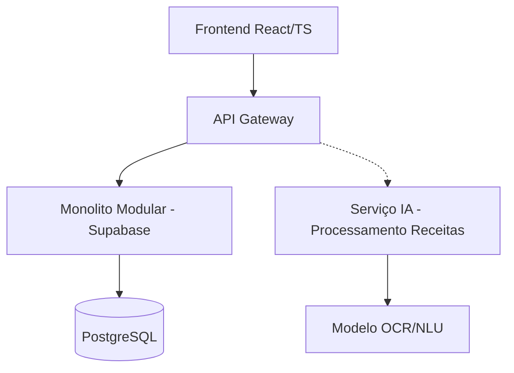

# Contexto Técnico Homeo-AI

## Arquitetura Atual (MVP)


## Módulos Implementados
| Módulo | Status | Tecnologias | Endpoints Principais |
|--------|--------|-------------|----------------------|
| Gestão Pedidos | ✅ Produção | React, Supabase Functions | `/api/pedidos`, `/api/receitas` |  
| Validação Receitas | ✅ Produção | Tesseract OCR, spaCy | `/api/processar-receita` |
| Estoque Básico | ✅ Produção | Supabase RLS | `/api/insumos`, `/api/lotes` |
| Orçamentação | 🚧 Desenvolvimento | Python, FastAPI | `/api/calcular-orcamento` |

## Dependências Críticas
```python
# Exemplo de fluxo IA processamento receitas
def processar_receita(file):
    texto = ocr.extract(file) # Tesseract
    entities = nlu.process(texto) # spaCy PT-BR
    return {
        "paciente": entities['nome'],
        "medicamentos": parse_medicamentos(entities),
        "validado": False
    }
```

## Próximos Passos Prioritários
1. Integração completa serviço orçamentação
   - Pré-requisito: Finalizar modelo custos insumos (ETA 2 semanas)
2. Implementar módulo contas a receber
   - Depende: Integração com Stripe (85% completo)
3. Treinar modelo NLU customizado
   - Bloqueador: Coleta dados validação (1,234 registros atual)

## Requisitos Não-Funcionais
```json
{
  "performance": {
    "processamento_receita": "<5s 95% requests",
    "disponibilidade": "99.9% SLA"
  },
  "segurança": {
    "lgpd": true,
    "criptografia": "AES-256",
    "backups": "diários"
  }
}
```

## Tech Debt Conhecido
- [ ] Migração autenticação para Auth0 (Prioridade Alta)
- [ ] Refatoração módulo estoque para Clean Architecture
- [ ] Implementação completa TypeScript no backend
