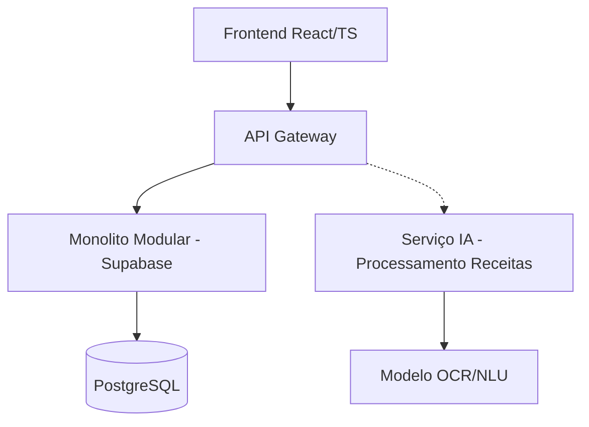

# Contexto do Projeto Pharma.AI

## 1. Visão Geral do Projeto

Pharma.AI é uma aplicação web abrangente projetada para Farmácias de Manipulação, oferecendo uma plataforma rica em funcionalidades para gerenciamento de prescrições, inventário, pedidos, transações financeiras e gerenciamento de usuários. O projeto utiliza inteligência artificial em diversos módulos para otimizar processos, desde o processamento de receitas até previsão de demanda e precificação.

A aplicação segue uma arquitetura híbrida com um monólito modular para o núcleo do sistema e microsserviços para funcionalidades de IA. O desenvolvimento está estruturado em três fases principais: MVP, Expansão Funcional, e Inteligência Artificial Plena.

## 2. Arquitetura Técnica

### 2.1. Visão Geral da Arquitetura

O Pharma.AI utiliza uma arquitetura híbrida com quatro componentes principais:
* **Monolito Modular**: Núcleo do sistema (cadastros, pedidos, estoque, financeiro)
* **Microsserviços de IA**: Processamento de receitas, modelos preditivos, chatbots
* **Automação n8n**: Fluxos de trabalho automáticos, notificações
* **Gateway de Notificações**: Gerenciamento de comunicações multicanal

### 2.2. Stack Tecnológica

#### Frontend
* **Framework Principal**: React/TypeScript (v18.0.0+)
* **UI/Estilização**: Shadcn/UI + Tailwind CSS
* **Roteamento**: React Router DOM (v6.0.0+)
* **Gerenciamento de Estado**: React Query (TanStack Query v4.0.0+)
* **Validação**: Zod (v3.0.0+)

#### Backend
* **Backend-as-a-Service**: Supabase
  * PostgreSQL (Banco de dados principal)
  * Auth (Autenticação)
  * Storage (Armazenamento de arquivos)
  * Realtime (Atualizações em tempo real)
  * Edge Functions/Functions (Lógica de negócios)
* **Microsserviços**:
  * Python/FastAPI (Microsserviços de IA)
  * Node.js/TypeScript (Funções serverless complementares)

#### IA/ML
* **OCR**: Google Vision AI, AWS Textract
* **NLU/NLP**: spaCy, Transformers
* **LLMs**: OpenAI, Gemini
* **Modelos Preditivos**: scikit-learn, TensorFlow
* **Armazenamento de Embeddings**: pgvector

#### Automação
* **Ferramenta de Fluxos**: n8n

## 3. Fases de Implementação e Módulos

O desenvolvimento do Pharma.AI está organizado em três fases principais:

### 3.1. FASE 1: MVP (Produto Mínimo Viável)

## Arquitetura Atual (MVP)


## Módulos Implementados
| Módulo | Status | Tecnologias | Endpoints Principais |
|--------|--------|-------------|----------------------|
| Gestão Pedidos | ✅ Produção | React, Supabase Functions | `/api/pedidos`, `/api/receitas` |  
| Validação Receitas | ✅ Produção | Tesseract OCR, spaCy | `/api/processar-receita` |
| Estoque Básico | ✅ Produção | Supabase RLS | `/api/insumos`, `/api/lotes` |
| Orçamentação | 🚧 Desenvolvimento | Python, FastAPI | `/api/calcular-orcamento` |

## Dependências Críticas
```python
# Exemplo de fluxo IA processamento receitas
def processar_receita(file):
    texto = ocr.extract(file) # Tesseract
    entities = nlu.process(texto) # spaCy PT-BR
    return {
        "paciente": entities['nome'],
        "medicamentos": parse_medicamentos(entities),
        "validado": False
    }
```

## Próximos Passos Prioritários
1. Integração completa serviço orçamentação
   - Pré-requisito: Finalizar modelo custos insumos (ETA 2 semanas)
2. Implementar módulo contas a receber
   - Depende: Integração com Stripe (85% completo)
3. Treinar modelo NLU customizado
   - Bloqueador: Coleta dados validação (1,234 registros atual)

## Requisitos Não-Funcionais
```json
{
  "performance": {
    "processamento_receita": "<5s 95% requests",
    "disponibilidade": "99.9% SLA"
  },
  "segurança": {
    "lgpd": true,
    "criptografia": "AES-256",
    "backups": "diários"
  }
}
```

## Tech Debt Conhecido
- [ ] Migração autenticação para Auth0 (Prioridade Alta)
- [ ] Refatoração módulo estoque para Clean Architecture
- [ ] Implementação completa TypeScript no backend
