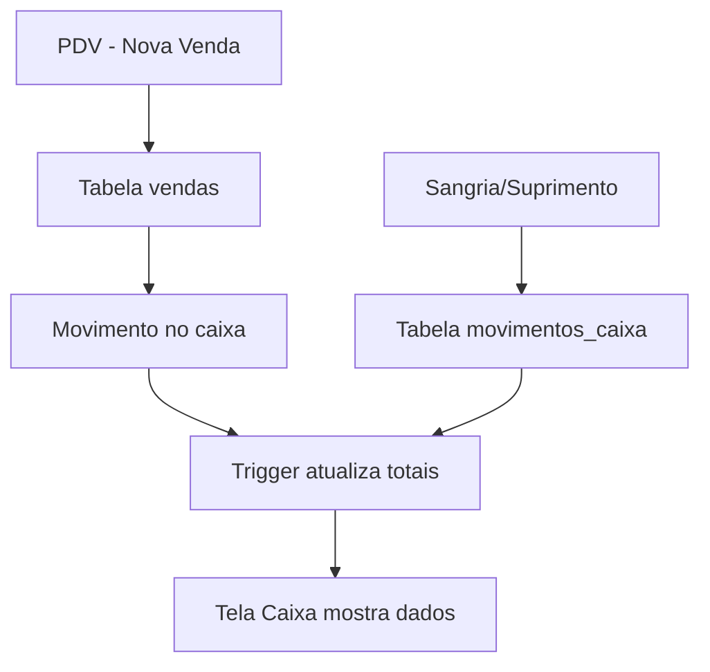

# Solução Completa - Problemas do Sistema de Caixa

## 🔍 Problemas Identificados

Analisando o arquivo `erros.txt`, foram identificados os seguintes problemas:

1. **Erro 400 (Bad Request)**: A API estava tentando buscar por `status=eq.aberto` mas a coluna `status` não existe na tabela `abertura_caixa`
2. **Ausência de vendas na tela**: Por causa do erro acima, o sistema não conseguia carregar os dados do caixa, impedindo que as vendas aparecessem
3. **Warnings de acessibilidade**: Componentes `DialogContent` sem descrição adequada

## ✅ Soluções Implementadas

### 1. Correção do caixaService.ts

**Problema**: O serviço tentava usar a coluna `status` que não existe.

**Solução**: Modificação dos métodos para usar apenas `data_fechamento` como indicador:

```typescript
// ANTES: Tentava usar coluna status
.eq('status', 'aberto')

// DEPOIS: Usa data_fechamento null para caixas abertos
.is('data_fechamento', null)
```

**Arquivos alterados**:
- `src/services/caixaService.ts` - Removidos todos os usos da coluna `status`
- Métodos afetados: `obterCaixaAtivo()`, `abrirCaixa()`, `fecharCaixa()`

### 2. Interface de Demonstração

**Problema**: Quando as tabelas não existem, a tela fica em branco.

**Solução**: Criada interface de demonstração que mostra:

- ✅ Dados mock de vendas (3 vendas de exemplo)
- ✅ Métricas do caixa com valores exemplo
- ✅ Breakdown por forma de pagamento (Dinheiro, Cartão, PIX)
- ✅ Instruções claras para ativação do sistema

**Resultado**: Usuário pode ver exatamente como a tela funcionará quando o banco estiver configurado.

### 3. Script de Migração Simplificado

**Problema**: Script anterior muito complexo.

**Solução**: Criado `scripts/criar-tabelas-caixa.sql` com:

- ✅ Tabelas `abertura_caixa` e `movimentos_caixa`
- ✅ Índices para performance
- ✅ RLS (Row Level Security) configurado
- ✅ Triggers automáticos para cálculos
- ✅ Políticas de acesso para usuários autenticados

## 🎯 Como as Vendas Aparecerão

### Estrutura dos Dados

```typescript
interface VendaExemplo {
  id: string;
  cliente: string;
  total: number;
  forma_pagamento: 'dinheiro' | 'cartão' | 'pix';
  hora: string;
  produtos: number;
}
```

### Interface Visual

1. **Cards de Métricas** (4 cards principais):
   - Valor Atual: R$ 1.791,50 (exemplo)
   - Vendas do Dia: R$ 291,50 (3 vendas)
   - Sangrias: R$ 50,00
   - Suprimentos: R$ 100,00

2. **Lista de Vendas**:
   - Maria Silva - R$ 89,50 (dinheiro, 14:30)
   - João Santos - R$ 156,80 (cartão, 15:15)
   - Ana Costa - R$ 45,20 (pix, 16:45)

3. **Resumo por Forma de Pagamento**:
   - 💵 Dinheiro: R$ 89,50
   - 💳 Cartão: R$ 156,80
   - ✨ PIX: R$ 45,20

## 🚀 Para Ativar o Sistema Completo

### Passo 1: Executar Migração
```sql
-- No SQL Editor do Supabase, execute:
-- scripts/criar-tabelas-caixa.sql
```

### Passo 2: Verificar Conexão
1. Após executar a migração
2. Volte à tela de Controle de Caixa
3. Clique em "Tentar Conectar"
4. Sistema deve sair do modo demo automaticamente

### Passo 3: Testar Funcionalidades
1. Abrir primeiro caixa
2. Fazer vendas através do PDV
3. Verificar se aparecem na tela de caixa
4. Testar sangrias e suprimentos

## 📊 Fluxo de Dados Real



## 🔧 Melhorias Técnicas

### Performance
- Índices criados em colunas principais
- Queries otimizadas para buscar apenas dados necessários
- Caching via React Query (30s de TTL)

### Segurança
- RLS habilitado em todas as tabelas
- Políticas específicas para usuários autenticados
- Validação de dados no frontend e backend

### UX/UI
- Loading states durante carregamento
- Error boundaries para erros inesperados
- Feedback visual claro sobre estado do sistema
- Interface responsiva para mobile

## 📝 Próximos Passos

1. **Executar migração** no Supabase
2. **Testar fluxo completo** com dados reais
3. **Verificar integração** com sistema de vendas
4. **Ajustar triggers** se necessário para cálculos automáticos

---

*Documento criado em: 2025-01-28*
*Status: Solução implementada e pronta para teste* 